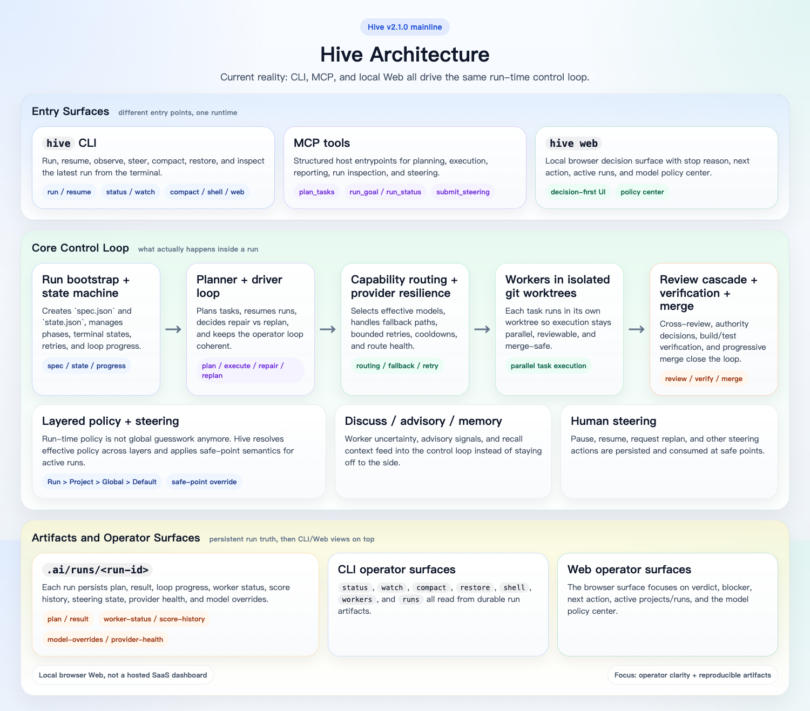
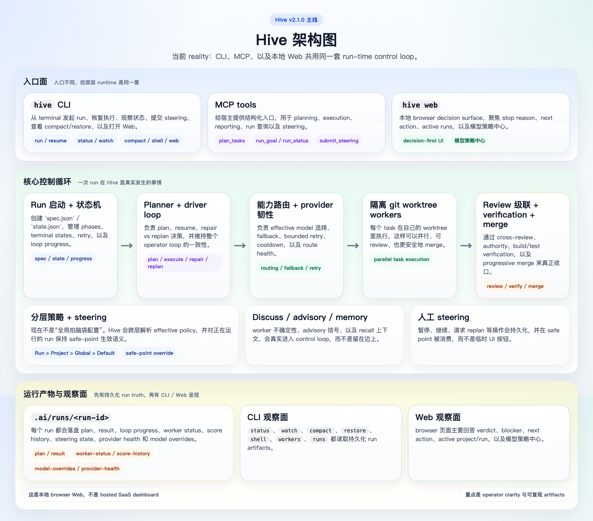

# Hive

**Multi-model orchestration for real coding loops — plan, dispatch, review, verify, merge.**

> Hive keeps the control loop. Different models can plan, execute, review, and report through one runtime.

[English](#english) | [中文](#中文)

<p align="center">
  
</p>

## Install

Stable install/upgrade (default = latest tag):

```bash
curl -fsSL https://raw.githubusercontent.com/CtriXin/hive/main/scripts/setup.sh | bash
```

Pin an exact release:

```bash
HIVE_INSTALL_REF=v2.1.4 curl -fsSL https://raw.githubusercontent.com/CtriXin/hive/main/scripts/setup.sh | bash
```

Bleeding edge from `main`:

```bash
HIVE_CHANNEL=main curl -fsSL https://raw.githubusercontent.com/CtriXin/hive/main/scripts/setup.sh | bash
```

Clean reinstall first (preserves `~/.hive` by default):

```bash
curl -fsSL https://raw.githubusercontent.com/CtriXin/hive/main/scripts/clean-install.sh | bash
```

Full clean including `~/.hive` config:

```bash
HIVE_PURGE_CONFIG=1 curl -fsSL https://raw.githubusercontent.com/CtriXin/hive/main/scripts/clean-install.sh | bash
```

> Installs to `~/.hive-orchestrator`. Custom location: `HIVE_HOME=/your/path curl -fsSL ... | bash`
> Run the same install command again to upgrade.

## For AI Agents

> Copy the prompt below into Claude Code, Cursor, or another coding agent if you want the agent to install and wire Hive for you.

```text
Install Hive from https://github.com/CtriXin/hive using the setup below.
Run commands, fix errors, and report results when done.

INSTALL:
  curl -fsSL https://raw.githubusercontent.com/CtriXin/hive/main/scripts/setup.sh | bash

UPGRADE:
  same command (defaults to latest stable tag)

PIN:
  HIVE_INSTALL_REF=v2.1.4 curl -fsSL https://raw.githubusercontent.com/CtriXin/hive/main/scripts/setup.sh | bash

CLEAN:
  curl -fsSL https://raw.githubusercontent.com/CtriXin/hive/main/scripts/clean-install.sh | bash

DIR:
  ~/.hive-orchestrator
  override with: HIVE_HOME=/path

REQUIRES:
- node >= 18
- ~/.config/mms/model-routes.json
  override with: export MMS_ROUTES_PATH=/path/to/model-routes.json

ENV KEYS (fallback when MMS routes are unavailable; at least one required):
  QWEN_API_KEY
  KIMI_API_KEY
  KIMI_CODING_API_KEY
  GLM_CN_API_KEY
  GLM_EN_API_KEY
  MINIMAX_CN_API_KEY
  MINIMAX_EN_API_KEY
  BAILIAN_API_KEY

CONFIG LAYERS:
- built-in defaults
- ~/.hive/config.json
- <repo>/.hive/config.json
- run-scoped overrides: .ai/runs/<run-id>/model-overrides.json

CLI QUICK CHECK:
- hive run "<goal>"
- hive status
- hive watch --once
- hive compact
- hive shell
- hive web --port 3100

MCP SETUP:
  claude mcp add hive -- node ~/.hive-orchestrator/dist/mcp-server/index.js

MCP TOOLS:
  capture_goal
  plan_tasks
  execute_plan
  dispatch_single
  diagnostics
  compact_run
  report
  run_goal
  resume_run
  run_status
  submit_steering

VERIFY:
  cd ~/.hive-orchestrator && npm run build
  cd ~/.hive-orchestrator && npm test

COMMON FAILURES:
- "No MMS route found"     -> check ~/.config/mms/model-routes.json
- "API key not configured" -> export the required provider key
- "Unknown provider"       -> check config/providers.json
```

---

<a id="english"></a>

## What Hive Is Now

Hive is a self-contained orchestration runtime for multi-model coding work. It is no longer just a planner-plus-workers sketch; the released mainline includes:

- a real run loop with planning, execution, review, verification, repair, and merge
- CLI operator surfaces such as `status`, `watch`, `compact`, `shell`, and `runs`
- a local browser decision surface via `hive web`
- layered model policy controls spanning Run, Project, Global, and Default
- persistent run artifacts under `.ai/runs/<run-id>/`

## v2.1.0 Reality

- **Released mainline** — `v2.1.0` is shipped and tagged.
- **Browser Web surface** — `hive web` serves a local decision-first dashboard, not just raw artifacts.
- **Model policy center** — inspect effective policy and edit Run / Project layers from Web.
- **Operator loop** — steering, watch, compact/restore, and HiveShell surfaces are part of the runtime.
- **Resilience path** — capability routing, provider fallback, bounded retries, and state tracking are wired into execution.

## Quick Start

**One-line install or upgrade**

```bash
curl -fsSL https://raw.githubusercontent.com/CtriXin/hive/main/scripts/setup.sh | bash
```

**Manual install**

```bash
git clone https://github.com/CtriXin/hive.git
cd hive
npm install
npm run build
```

**Run a goal**

```bash
hive run "Implement the auth callback flow and keep tests green"
```

**Observe the latest run**

```bash
hive status
hive watch --once
hive compact
hive shell
```

**Open the local Web surface**

```bash
hive web --port 3100
```

**Start the MCP server**

```bash
npm run start:mcp
```

See `docs/MCP_USAGE.md` for MCP setup and examples.

## Key Commands

```bash
hive run "<goal>"
hive resume --execute
hive status
hive steer
hive workers
hive score
hive watch --once
hive compact
hive restore
hive shell
hive runs
hive web --port 3100
```

## Configuration and Policy Layers

Hive merges model policy in this order:

1. built-in defaults
2. `~/.hive/config.json`
3. `<repo>/.hive/config.json`
4. `.ai/runs/<run-id>/model-overrides.json`

The Web policy center presents this as `Run > Project > Global > Default`, while the runtime keeps safe-point semantics for run-level changes.

Common configuration areas:

- tier model selection via `tiers.*`
- provider resolution and gateway settings
- discuss / collaboration transport under `collab`
- run-scoped overrides for next-stage changes

## Repository Layout

- `orchestrator/` — planner, driver loop, routing, review, Web adapter/server
- `mcp-server/` — MCP entrypoints and tools
- `config/` — provider registry, capabilities, scoring inputs, review policy
- `web/` — local browser UI for `hive web`
- `docs/` — architecture notes, phase docs, changelog, current-state reference

## Status

`v2.1.4` is released. The current mainline includes the local Web decision surface, layered model policy controls, doctor/install improvements, and MMS route bridging fixes. Richer product features such as auth, websocket push, and broader multi-project workflow are still future work.

## Contributing

We welcome PRs. Open an issue before large changes so the direction is clear.

Useful areas:

- provider integrations and route quality
- review and authority improvements
- operator ergonomics in CLI / Web
- documentation and reproducible examples

## License

MIT

---

<a id="中文"></a>

## 中文说明

<p align="center">
  
</p>

### Hive 现在是什么

Hive 现在不是一个只有“Claude 规划、别的模型执行”的概念图了，而是一套已经落地的多模型编排 runtime。当前主线已经包含：

- 真正的 run loop：`plan -> execute -> review -> verify -> repair -> merge`
- CLI 观察/恢复面：`status`、`watch`、`compact`、`shell`、`runs`
- 本地 browser Web 决策面：`hive web`
- 分层模型策略：`Run > Project > Global > Default`
- 持久化运行产物：`.ai/runs/<run-id>/`

### 当前版本重点

- **`v2.1.0` 已发布**，不是预发布草稿
- **`hive web` 已落地**，首屏是 decision surface，不再只是堆 artifact
- **模型策略中心已落地**，可以查看 effective policy，并编辑 Run / Project 层
- **主循环能力已收口**，包括 steering、watch、compact/restore、HiveShell
- **执行韧性已接入主路径**，包括 capability routing、provider resilience、bounded retry、状态机

### 快速开始

**安装 / 升级**

```bash
curl -fsSL https://raw.githubusercontent.com/CtriXin/hive/main/scripts/setup.sh | bash
```

**手动安装**

```bash
git clone https://github.com/CtriXin/hive.git
cd hive
npm install
npm run build
```

**执行一个目标**

```bash
hive run "实现 auth callback 流程，并保持测试通过"
```

**查看当前 run**

```bash
hive status
hive watch --once
hive compact
hive shell
```

**打开本地 Web 界面**

```bash
hive web --port 3100
```

**启动 MCP server**

```bash
npm run start:mcp
```

### 常用命令

```bash
hive run "<goal>"
hive resume --execute
hive status
hive steer
hive workers
hive score
hive watch --once
hive compact
hive restore
hive shell
hive runs
hive web --port 3100
```

### 配置与策略优先级

Hive 的配置层级是：

1. 内置默认值
2. `~/.hive/config.json`
3. `<repo>/.hive/config.json`
4. `.ai/runs/<run-id>/model-overrides.json`

Web 里展示的是 `Run > Project > Global > Default`，运行时对 run 级改动保持 safe-point 生效语义，不会粗暴打断正在执行的 worker。

常见配置点包括：

- `tiers.*` 的模型选择
- provider / gateway 路由
- `collab` 下的讨论与协作 transport
- run 级下一阶段 override

### 仓库结构

- `orchestrator/`：planner、driver loop、routing、review、Web adapter/server
- `mcp-server/`：MCP tools 入口
- `config/`：provider、capability、评分输入、review policy
- `web/`：`hive web` 的本地前端
- `docs/`：变更文档、phase 文档、当前状态说明

### 当前状态

`v2.1.4` 已正式发布。当前已经有本地 Web decision surface、分层模型策略控制、doctor / installer 改进，以及 MMS route bridging 修复；更完整的 auth、websocket push、广义 multi-project 产品化流程还属于后续工作。

### 参与贡献

欢迎 PR。较大的改动建议先开 issue 对齐方向。

优先方向：

- provider 接入与 route 质量
- review / authority 路径增强
- CLI / Web 操作体验
- 文档与可复现实例

### License

MIT
